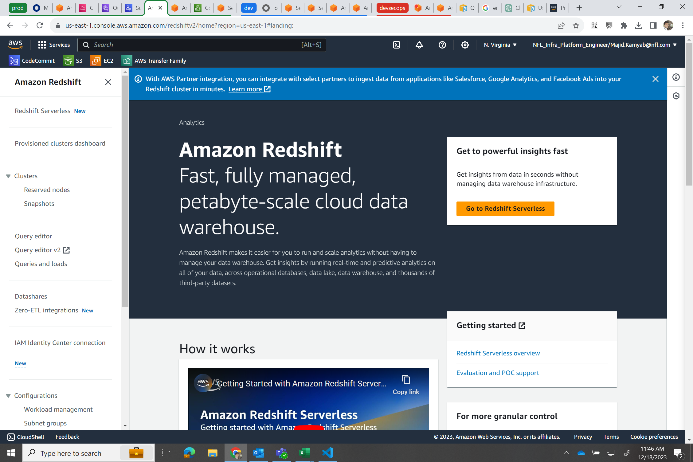
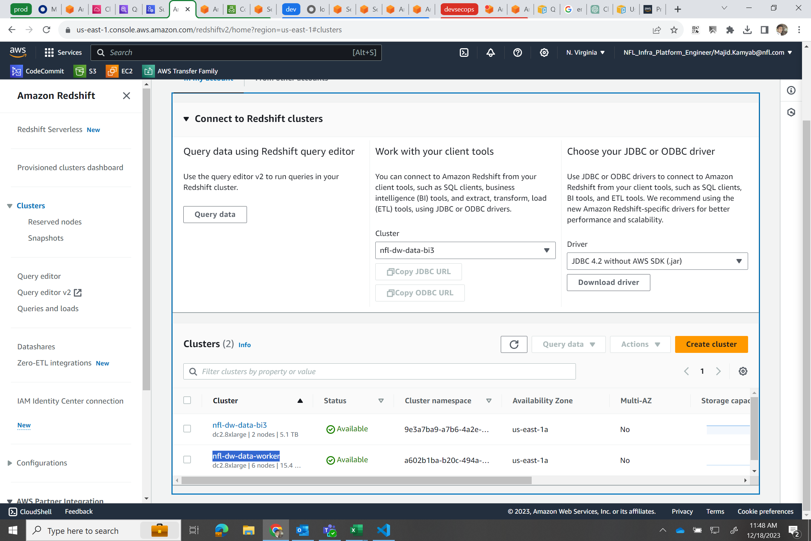
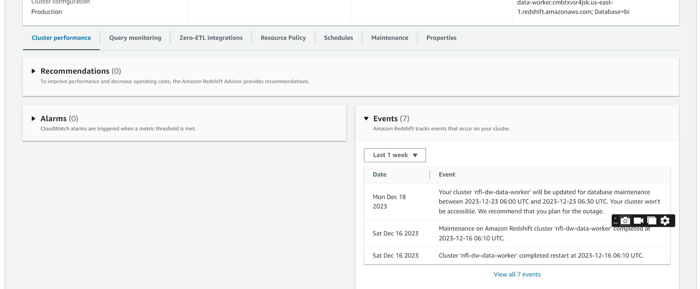
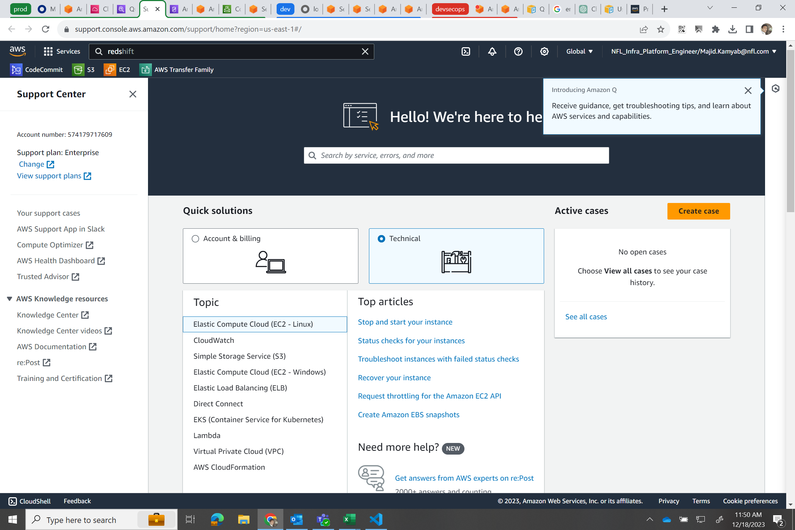
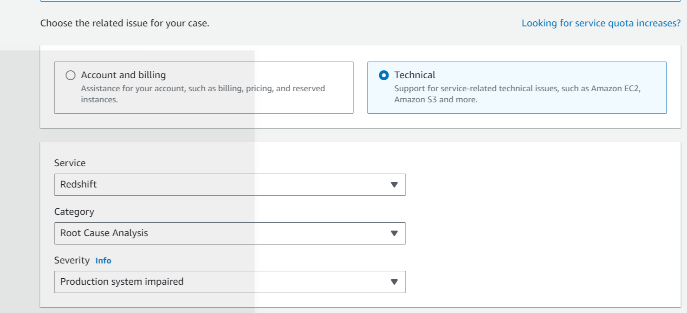
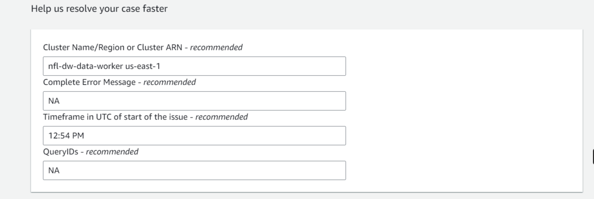

# Redshift Resume Runbook
## Try checking the status from console
You would receive a notification from SNS about redshift instance not being able to be resumed. 
sign in to `nfl-data-bi` (account number= `574179717609`) , Go to redshift in the console in AWS console.

click on `clusters`, in case you couldnt see the clusters, click on Amazon redshift at the top to change from Amazon Redshift Serverless to Amazon Redshift.
After you clicked on clusters, check the status of `nfl-dw-data-worker`,



if it is available then it is ok otherwise wait for 10 minutes and if it is still not `available` then try pausing and resuming the cluster. 
you can also check events in the events of redshift in console. 
.
The following CLI commands is helpful to grasp the same info. To see if the cluster is available check `ClusterStatus` from following command.
``` powershell
aws redshift describe-clusters --cluster-identifier nfl-dw-data-worker --profile <profile>
```

to check the events use:

``` powershell
aws redshift describe-events --source-identifier <schedule-name>  --source-type scheduled-action  --profile <profile>
```
## Filing a support ticket

Reach out to saketha.suddapalli@nfl.com, majid.kamyab@nfl.com and joseph.steinke@nfl.com to file a support ticket for AWS as follows:
Go to `Support Center`, and create a case:

click on `technical` and fill as below and click on `Next step: Additional information`:

in the `additional information` page fill as below:
**Subject**: 

Redshift cluster not resuming as part of schedule

**Description**: 

The scheduled resumption of the Redshift cluster is not occurring as planned. Attempts to manually resume the cluster have also been unsuccessful.

**Cluster Name/Region or Cluster ARN - recommended**:

nfl-dw-data-worker us-east-1

**Timeframe in UTC of start of the issue - recommended**:

fill as required


in the next page click on contact us through chat which is the fastest response.   And fill the additional contacts with:

joseph.steinke@nfl.com,     saketha.suddapalli@nfl.com, majid.kamyab@nfl.com, kiran.raut@nfl.com, mastan.noorbhasha@nfl.com, ameenoddin.sayed@nfl.com, mihir.kulkarni@nfl.com

then click submit. 